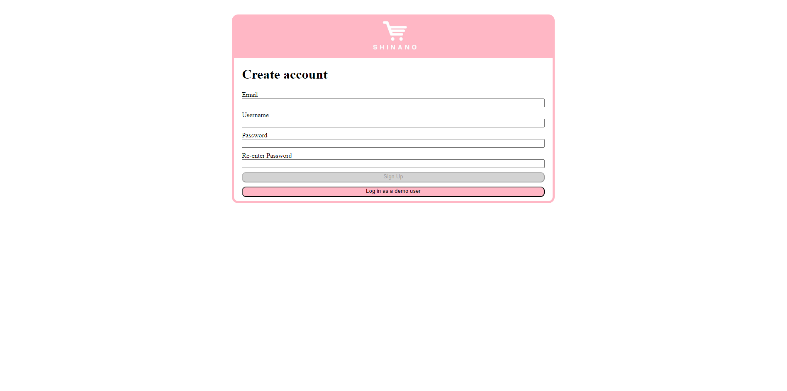
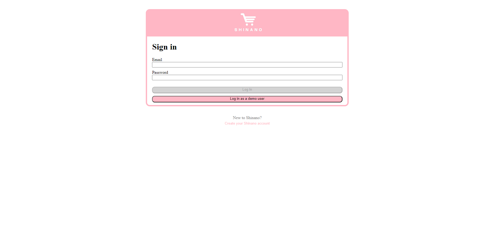
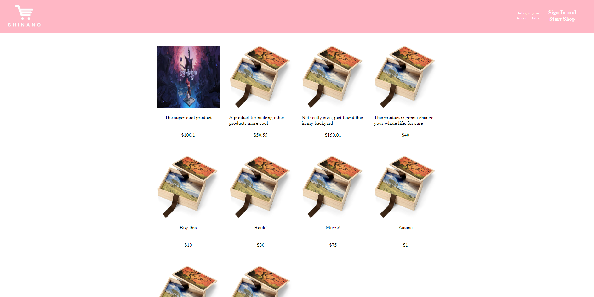
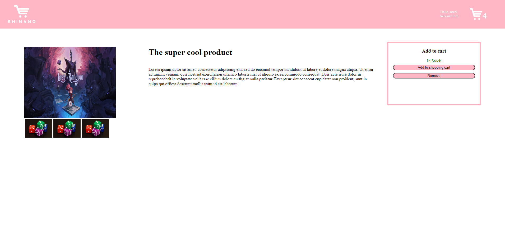
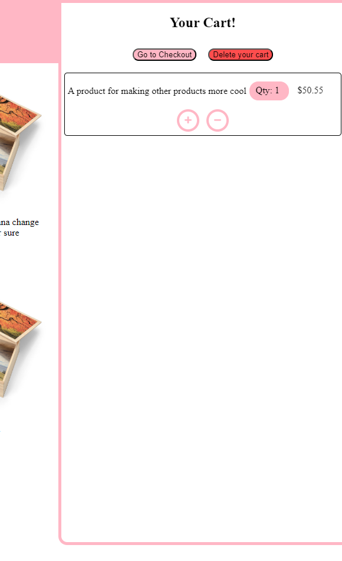
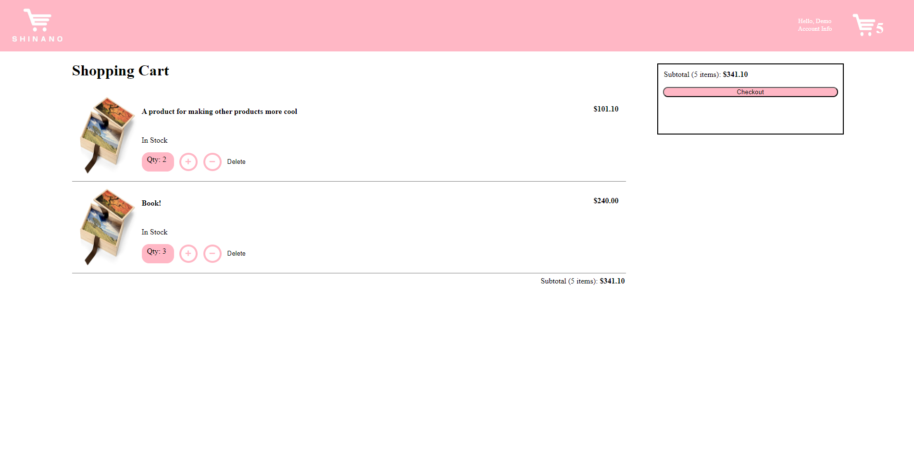

# Shinano

Shinano is a web application that is meant to mimic an ecomerce platform, Amazon specifically, and allows you to create, update, and delete prodducts
and carts. You are only able to create one cart at a time. This ReadMe will provide you with the information to start Shinano.

## Technologies Used
   -  Flask/SQL Alchemy backend
   -  React/Redux frontend
   -  Alembic
   - Jinja2

   
   <!--  -->
   <!--  -->
   <!--  -->
   
   
   
   
   
   <!--  -->

## Sign Up Page


## Sign In Page


## Home Page


## Product Page


## Cart Modal


## Cart Page


## Getting started
Shinano requires pythin version 3.9.4 and node.js on your machine. Once you have installed thise, follow the steps below:

1. Clone this repository:
```bash
   git clone https://github.com/TheSicilian12/capstone.git
```

2. Install dependencies

      ```bash
      pipenv install -r requirements.txt
      ```

3. Create a **.env** file based on the example with proper settings for your
   development environment

4. Go to your pipenv and migrate your database, seed your database, and run your Flask app

```bash
pipenv shell
```

```bash
flask db upgrade
```

```bash
flask seed all
```

```bash
flask run
```

5. Once the Flask server is running, navigate to the client directory

6. Install the dependencies: `npm install

7. Start the frontend: `npm start`

8. The frontend will be accesbile at http://localhost:3000/

# Features

## Products
- Authorized user can create a product
- Any user can view / read a product
- Authorized user can update a product
- Authorized user can delete a product

## Cart
- Authorized user can create a cart. (Only one cart can be created per user without a cart)
- Authorized user can view / read their cart.
- Authorized user can update their cart with items.
- Authorized user can delete their cart. (Including all items)

## Navigating Shinano

Shinano is currently in development and does not have all of the functionality the author intends for it to have.
The current functions are:

1. `Login` using the demo user or another account.

2. `Signup` using any valid data to create an account.

3. Create a `product` that you would like to have on Shinano.

4. Navigate to `products`.

5. Edit any `product` that you have created.

6. Delete any `product` that you have created. This also removes the `product` from other users carts.

7. Create a `cart` to start shopping. This is either done manually by the user, or automatically when shopping begins.
Only a logged in user may create a `cart` and shop.

8. Look at the items in your `cart`.

9. Edit the items in your `cart`.

10. Delete your entire `cart`. This actually deletes your cart, not just removing your items from an existing cart.

## Contributors

Contributors:

Michael Guidera https://github.com/TheSicilian12
